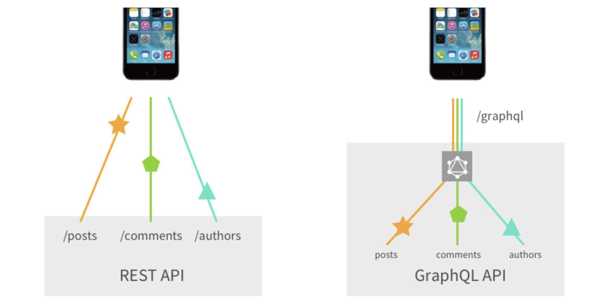

### GraphQL(Graph Query Language)가 무엇일까?

> 페이스북에서 만든 API Layer에서 사용되는 쿼리 언어입니다.

<br/>

### 사용하는 목적은?

<div> 
일반적인 SQL은 데이터베이스 시스템에서 저장된 데이터를 효율적으로 가져오는 것이 목적이지만, <br/>
<b>GraphQL</b>은 웹 클라이언트가 데이터를 서버로부터 효율적으로 가져오는 것이 목적입니다.
</div>

### 특징?

- 특정 데이터베이스, 플랫폼 혹은 네트워크 방식 등에 종속되지 않습니다. 일반적으로 gql의 인터페이스간 송수신은 네트워크 레이어 L7의 HTTP POST 메서드와 웹소켓 프로토콜을 활용합니다. 필요에 따라서는 얼마든지 L4의 TCP/UDP를 활용하거나 심지어 L2 형식의 이더넷 프레임을 활용 할 수도 있습니다.

- gql 스키마의 타입마다 데이터베이스 SQL 쿼리가 달라집니다. REST API는 각 endpoint마다 데이터베이스 SQL 쿼리가 달라집니다.

- 하나의 endpoint로 구성되어있어서, 여러번 네트워크 호출을 할 필요 없이 한번의 호출로 처리할 수 있습니다.
  REST API는 url, method 등을 조합하기 때문에 다양한 endpoint가 존재합니다.

  

### 구조

#### Query / Mutation

> Query는 R(Read)이고, Mutation은 CUD(Create Update Delete)로 사용됩니다.

Query는 일반 쿼리와 오퍼레이션 네임 쿼리로 분류됩니다.

```javascript
// 일반 쿼리
{
}
```
