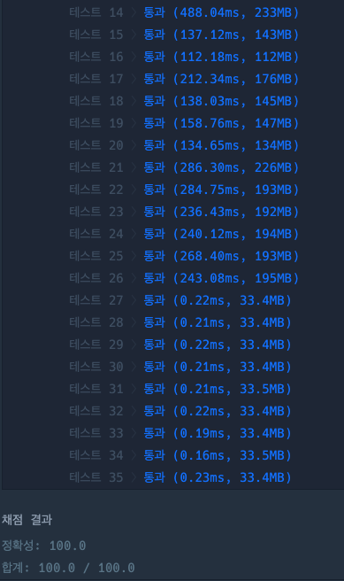

#### 문제 링크

https://school.programmers.co.kr/learn/courses/30/lessons/159993

## 접근 방법

`구현`

처음에 각 그래프(BFS)탐색으로 각 노드마다 정점과 간선의 갯수를 파악해서 테스트케이스를 풀었다.
하지만, 여러개의 런타임에러와 33번과 35번에서 계속 틀렸다...
몇시간 고민 끝에.. 질문하기 통해서 다른사람들이 올려놓은 해설법을 보고 풀 수 있었다.

접근법은 **그래프의 정점과 간선의 특징**을 잘 파악하는 것이다.

1. 생성정점 = 모든 정점 중 **받는 간선이 없는 정점**
2. 모든 그래프의 갯수 = 생성정점에서 나가는 간선 수와 같다.
3. 막대그래프 갯수 = **보내는 간선이 없는 정점**
4. 8자그래프 갯수 = **보내는 간선이 2개 이상이고, 받는 간선이 2개 이상인 정점**
5. 도넛그래프 갯수 = 모든 그래프 갯수 - 막대그래프 갯수 - 8자그래프 갯수

## 코드풀이

```javascript
function solution(edges) {
  const graph = {}
  let [정점, 도넛, 막대, 팔자] = [0, 0, 0, 0]

  edges.forEach(([start, end]) => {
    graph[start]
      ? graph[start].send++
      : (graph[start] = { send: 1, recevie: 0 })
    graph[end] ? graph[end].recevie++ : (graph[end] = { send: 0, recevie: 1 })
  })

  for (const node in graph) {
    const { send, recevie } = graph[node]
    if (send >= 2 && recevie == 0) 정점 = +node

    if (send == 0) 막대++
    if (send >= 2 && recevie >= 2) 팔자++
  }
  도넛 = graph[정점].send - 팔자 - 막대

  return [정점, 도넛, 막대, 팔자]
}
```


