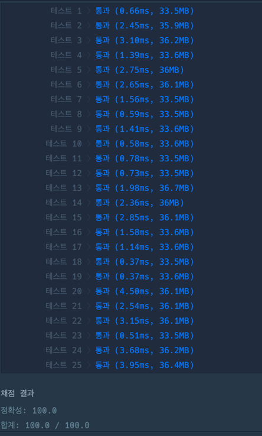

## 문제
`DFS` `시뮬레이션`

카카오배 양궁대회가 열렸습니다.    
라이언은 저번 카카오배 양궁대회 우승자이고 이번 대회에도 결승전까지 올라왔습니다. 결승전 상대는 어피치입니다.    
카카오배 양궁대회 운영위원회는 한 선수의 연속 우승보다는 다양한 선수들이 양궁대회에서 우승하기를 원합니다.   
따라서, 양궁대회 운영위원회는 결승전 규칙을 전 대회 우승자인 라이언에게 불리하게 다음과 같이 정했습니다.    

1. 어피치가 화살 n발을 다 쏜 후에 라이언이 화살 n발을 쏩니다.
2. 점수를 계산합니다.
   1. 과녁판은 아래 사진처럼 생겼으며 `가장 작은 원의 과녁 점수는 10점`이고 `가장 큰 원의 바깥쪽은 과녁 점수가 0점`입니다.
   2. 만약, k(k는 1~10사이의 자연수)점을 어피치가 a발을 맞혔고 라이언이 b발을 맞혔을 경우 **더 많은 화살을 k점에 맞힌 선수가 k 점을 가져갑니다.**     
      단, `a = b`일 경우는 **어피치가 k점을 가져갑니다**. k점을 여러 발 맞혀도 k점 보다 많은 점수를 가져가는 게 아니고 k점만 가져가는 것을 유의하세요.     
      또한 `a = b = 0` 인 경우, 즉, 라이언과 어피치 모두 k점에 단 하나의 화살도 맞히지 못한 경우는 **어느 누구도 k점을 가져가지 않습니다.**
      - 예를 들어, 어피치가 10점을 2발 맞혔고 라이언도 10점을 2발 맞혔을 경우 어피치가 10점을 가져갑니다.
      - 다른 예로, 어피치가 10점을 0발 맞혔고 라이언이 10점을 2발 맞혔을 경우 라이언이 10점을 가져갑니다.
      모든 과녁 점수에 대하여 각 선수의 최종 점수를 계산합니다.
3. 최종 점수가 더 높은 선수를 우승자로 결정합니다. 단, 최종 점수가 같을 경우 어피치를 우승자로 결정합니다

현재 상황은 어피치가 화살 n발을 다 쏜 후이고 라이언이 화살을 쏠 차례입니다.
라이언은 어피치를 가장 큰 점수 차이로 이기기 위해서 n발의 화살을 어떤 과녁 점수에 맞혀야 하는지를 구하려고 합니다.

화살의 개수를 담은 자연수 `n`, 어피치가 맞힌 과녁 점수의 개수를 10점부터 0점까지 순서대로 담은 정수 배열 `info`가 매개변수로 주어집니다.    
이때, **라이언이 가장 큰 점수 차이로 우승**하기 위해 n발의 화살을 어떤 과녁 점수에 맞혀야 하는지를 **10점부터 0점까지 순서대로 정수 배열에 담아 return** 하도록 solution 함수를 완성해 주세요.    
만약, **라이언이 우승할 수 없는 경우**(무조건 지거나 비기는 경우)는 **[-1]을 return** 해주세요.

**라이언이 가장 큰 점수 차이로 우승할 수 있는 방법이 여러 가지 일 경우, 가장 낮은 점수를 더 많이 맞힌 경우를 return** 해주세요.

## 접근 방법

제한 사항은 `1 ≤ n ≤ 10`, `info의 길이 = 11` 이므로    
1. 재귀를 이용해 점수별로 라이언이 얻을 수 있는 경우의 수를 구했다.
(ex) 라이언은 10점을 맞출수도 있고, 맞추지 못할 수도 있다.    
_라이언이 사용한 화살의 갯수가 n과 같아지거나, 점수가 0점보다 작아지면 종료한다._
2. 앞서 라이언이 얻을 수 있는 모든 화살 정보를 탐색하면서    
라이언이 어피치를 이기는 경우, 두 사람의 점수차를 최댓값을 유지한 채,    
라이언이 가장 큰 점수차로 이기는 화살 정보를 구한다.

3. 2번에서 얻은 화살 정보들을 낮은 점수로 정렬하여 결과를 구한다.


## 코드풀이

```javascript
let shoot = Array.from({length: 11},  ()=> 0);
let allList = []

const getSum = (arr) => {
    return arr.reduce((a,b) => a+b, 0);
}

const getScoreSum = (arr) => {
    return arr.reduce((acc, cur, index) => acc + cur*(10-index) ,0)
}

const dfs = (score, info, n) => {
    if(score < 0 || getSum(shoot) >= n) { // 재귀 종료조건
        allList.push([...shoot])
        return
    };

    // 해당 점수를 얻는 경우
    shoot[10-score] = Math.min(info[10-score]+1, n-getSum(shoot));
    dfs(score-1, info, n);
    
    // 해당 점수를 얻지 못하는 경우
    shoot[10-score] = 0;
    dfs(score-1, info, n);

}

function solution(n, info) {
    let answer = [];
    let gap = 0;
    dfs(10, info, n)

    allList.map((item) => {
        let lion = 0;
        let apeach = 0;

        // 라이언, 어피치 점수계산
        for(let index=0; index<11; index++){
            let score = 10-index;

            if(info[index] > 0 || item[index] > 0){
                if(info[index] < item[index]){
                    lion += score
                }else{
                    apeach += score
                }
            }
        }


        // 라이언이 가장 큰 점수로 이기는 경우
        if(lion > apeach){
            if(gap < (lion - apeach)){
                answer = [[...item]]
                gap = lion - apeach
            } else if(gap == (lion - apeach)){
                answer.push(item)
            }else if(gap == 0){
                answer.push(item)
                gap = lion - apeach
            }
        }

    });

    // 가장 큰 점수로 이기는 경우 중, 가장 낮은 점수 기준 오름차순으로 정렬
    answer.sort((a,b) => getScoreSum(a) - getScoreSum(b));
    return answer.length == 0 ? [-1] : answer[0]
}
}
```


#### 문제 링크

https://school.programmers.co.kr/learn/courses/30/lessons/92342